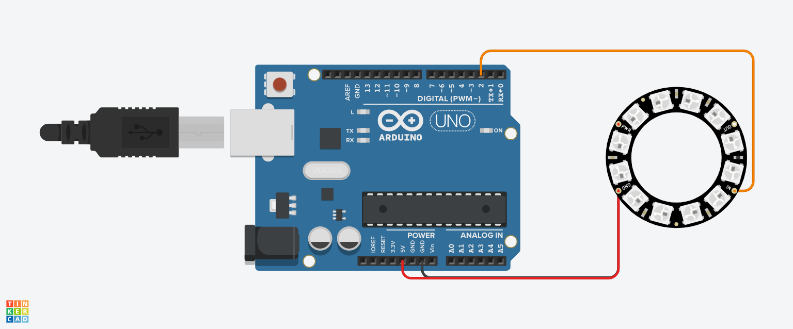

 # RGB-LED-CONTROLLER
 The RGB LED Controller is an interactive Arduino project that lets users customize LED colors and brightness using serial input. It allows precise control over individual LED color values and the number of LEDs activated, making it perfect for decorative lighting and DIY projects.
 # 🎨 RGB LED Controller with Arduino
 
 The **RGB LED Controller** is a fun and interactive Arduino project that lets users control RGB LED colors dynamically. By entering RGB values through the Serial Monitor, users can customize LED colors and adjust the number of LEDs that light up in real time.
 
 ## 📸 Circuit Diagram
 Here's the circuit setup for this project:
 
 
 
 ## 🔧 Features
 ✅ **Customizable Colors**: Users can set any RGB color values between 0-255.  
 ✅ **Adjustable LED Count**: Select the number of LEDs to turn on (1-12).  
 ✅ **User-Friendly**: Simple serial input system for easy operation.  
 
 ## 🛠 Components Used
 - **Arduino Board** (e.g., Arduino Uno)
 - **Adafruit NeoPixel RGB LED Strip** (or individual RGB LEDs)
 - **Jumper Wires**
 - **Power Supply** (for LEDs, if necessary)
 
 ## 🚀 How It Works
 1. **Connect the Circuit**: Follow the provided circuit diagram.
 2. **Upload the Code**: Load the `rgb_led_controller.ino` file to your Arduino.
 3. **Interact via Serial Monitor**: Enter RGB values and the number of LEDs to illuminate.
 4. **Watch the LEDs Change**: Observe real-time LED color updates.
 
 ## 📜 Code
 ```cpp
 #include <Adafruit_NeoPixel.h>
 
 int num1, num2, num3, nums;
 
 #define DELAY_TIME 100
 #define PIN 2
 #define NUMPIXELS 12
 #define LOW_RGB 0
 #define MAX_RGB 255
 #define LOW_PIN 1
 #define MAX_PIN 12
 
 Adafruit_NeoPixel pixels = Adafruit_NeoPixel(NUMPIXELS, PIN, NEO_GRB + NEO_KHZ800);
 
 void setup() {
   Serial.begin(9600);
   pixels.begin();
 }
 
 void loop() {
   Serial.print("Pick 1st color value (0-255): ");
   while (Serial.available() == 0) { delay(DELAY_TIME); }
   num1 = Serial.parseInt();
   if (num1 < LOW_RGB || num1 > MAX_RGB) {
     Serial.println("Invalid! Enter a value between 0-255.");
     return;
   }
   Serial.println(num1);
 
   Serial.print("Pick 2nd color value (0-255): ");
   while (Serial.available() == 0) { delay(DELAY_TIME); }
   num2 = Serial.parseInt();
   if (num2 < LOW_RGB || num2 > MAX_RGB) {
     Serial.println("Invalid! Enter a value between 0-255.");
     return;
   }
   Serial.println(num2);
 
   Serial.print("Pick 3rd color value (0-255): ");
   while (Serial.available() == 0) { delay(DELAY_TIME); }
   num3 = Serial.parseInt();
   if (num3 < LOW_RGB || num3 > MAX_RGB) {
     Serial.println("Invalid! Enter a value between 0-255.");
     return;
   }
   Serial.println(num3);
 
   pixels.clear();
   pixels.setPixelColor(0, num1, num2, num3);
   pixels.show();
   delay(DELAY_TIME);
 
   Serial.print("Pick amount of LEDs to turn on (1-12): ");
   while (Serial.available() == 0) { delay(DELAY_TIME); }
   nums = Serial.parseInt();
   if (nums < LOW_PIN || nums > MAX_PIN) {
     Serial.println("Invalid! Enter a value between 1-12.");
     return;
   }
   Serial.println(nums);
 
   pixels.clear();
   for (int j = 0; j < nums; j++) {
     pixels.setPixelColor(j, num1, num2, num3);
   }
   pixels.show();
   delay(DELAY_TIME);
 }
 ```
 
 ## 📢 Notes
 - Ensure the **Adafruit NeoPixel library** is installed before uploading the code.
 - Use the **Serial Monitor** (baud rate: 9600) to input RGB values and LED count.
 - If the LEDs do not light up, check the **connections and power supply**.
 
 Enjoy customizing your LEDs! 🌈
